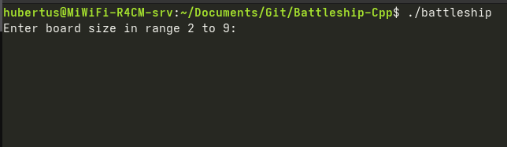
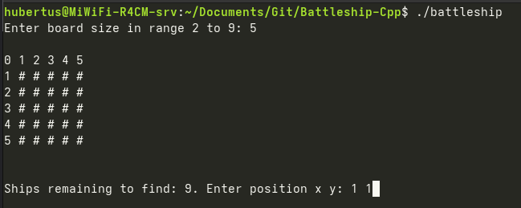
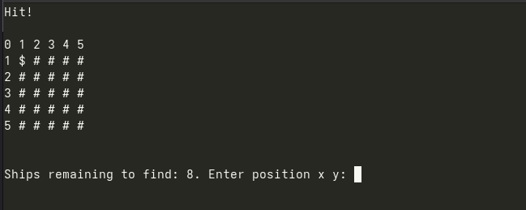

# Battleship Console Game (C++)

A console-based implementation of the classic Battleship game written in C++.
The project focuses on fundamental programming concepts, dynamic data structures, and game logic.

---

## 🎯 Project Overview

This project implements a simplified version of the Battleship game, where ships are randomly placed on a square board and the player tries to find them by entering coordinates.

The board size is configurable, and the game tracks player performance based on time and accuracy.

---

## 🚀 Features

* dynamic board size (2–9)
* random ship placement
* turn-based gameplay
* hit/miss detection
* prevention of repeated moves
* game timer (time to win)
* console-based UI

---

## 🧠 How It Works

1. The user selects the board size.
2. Ships are randomly placed on the board.
3. The player enters coordinates (x, y).
4. The system checks:
5. The game ends when all ships are found.

---
## 🧩 Board Symbols

The game uses the following symbols to represent the board state:

- `#` – unknown field (not yet checked)
- `$` – hit (ship found)
- `!` – miss (no ship)

⚠️ Note: Ships are hidden during the game and are not displayed on the board.

---

## 🛠️ Technologies

* C++
* STL (vector, random)
* Console I/O

---

## ▶️ How to Run

### Compile

```bash
g++ -std=c++17 -O2 -Wall battleship.cpp -o battleship
```

### Run

```bash
./battleship
```

---

## 📂 Project Structure

```text
.
├── battleship.cpp
└── README.md
```

---

## 🧪 Example Gameplay

### 🔹 Game Start



---

### 🔹 Initial Board



---

### 🔹 Hit Example



---

## 📈 Learning Outcomes

Through this project, I worked on:

* object-oriented programming (C++)
* working with dynamic 2D arrays (vector)
* random number generation
* console-based UI design
* implementing game logic and validation
* writing clean and readable code

---

## 🔧 Possible Improvements

* graphical interface (SFML / SDL)
* better input validation
* difficulty levels
* smarter ship placement algorithm
* multiplayer mode

---

## 👨‍💻 Author

Hubert Jabłoński
